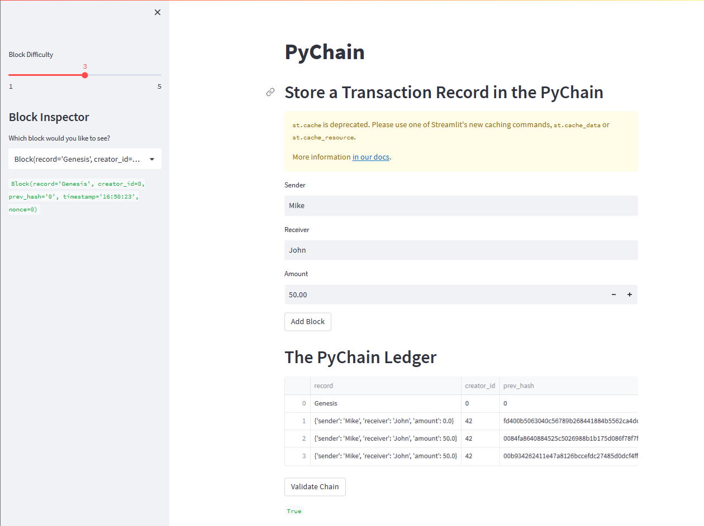

# Building a Blockchain-based Ledger System

This project is designed to build a blockchain-based ledger system that allows users to store transaction records.

## Technologies

The project uses the following technologies:

This project was created using the following technologies:

- Python
- Streamlit - for user interface
- dataclasses
- typing (Any, List)
- datetime
- pandas library
- hashlib

## Installation Guide

1. Install the required Python libraries:

    ```
    pip install streamlit 
    pip install pandas 
    pip install hashlib
    pip install dataclasses
    pip install datetime
    ```

## Usage

To use the PyChain ledger, follow the steps below:

1. In the terminal (bitbash, or other), navigate to the project folder `Challenge_18/StarterCode`
2. In the terminal, run the Streamlit application by using `streamlit run pychain.py`.
3. Enter values for the sender, receiver, and amount, and then click the "Add Block" button. Do this several times to store several blocks in the ledger.
4. Verify the block contents and hashes in the Streamlit drop-down menu.  
5. Test the blockchain validation process by using the web interface.  


## License

This project is licensed under the [MIT License](https://opensource.org/licenses/MIT).
